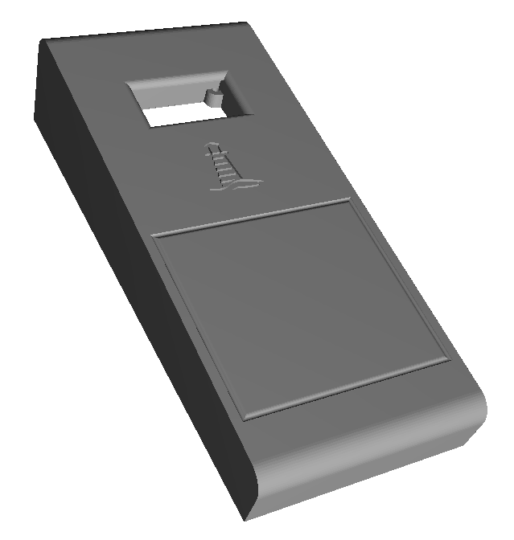

# Split67

Split67 is a splitted common 67% ISO DE keyboard layout with processor daughterboards extended by a side case housing a TPS43 touch pad and a 64x128 Oled display. Left and right keyboard Pcb is connected with TRRS using serial communication, right keyboard part and sidecase are connected with TRRS using i2c communication. To support a close contact of the parts, magnets are used.

## QMK Firmware source files

<https://github.com/oceanKeebs/qmk_firmware/tree/master/keyboards/oceankeebs/split67>

## QMK Firmware hex files

**without via support:**
[Split67_defaultHex](HexFiles/oceankeebs_split67_default.hex)

**with via support:**
[Split67_viaHex](HexFiles/oceankeebs_split67_via.hex)

## PCBs

### Processor Board

The processor board includes the ProMicro and connectors for i2c, serial communication and keyboard Pcb control.

### Left Pcb

### Right Pcb

## Case

### Left keyboard part

[LeftCaseTop_stl](StlFiles/Case_L_B.stl)

[LeftCaseBottom_stl](StlFiles/Bottom_L.stl)

### Right keyboard part

[RightCaseTop_stl](StlFiles/Case_R_B.stl)

[RightCaseBottom_stl](StlFiles/Bottom_R.stl)

[UsbCoverBase_stl](StlFiles/USB-Cover_Base.stl)

[UsbCoverTop_stl](StlFiles/USB-Cover_Top.stl)

### SideCase

[SideCaseTop_stl](StlFiles/SideCase_B.stl)

[SideCaseBottom_stl](StlFiles/Bottom_Sidecase.stl)

